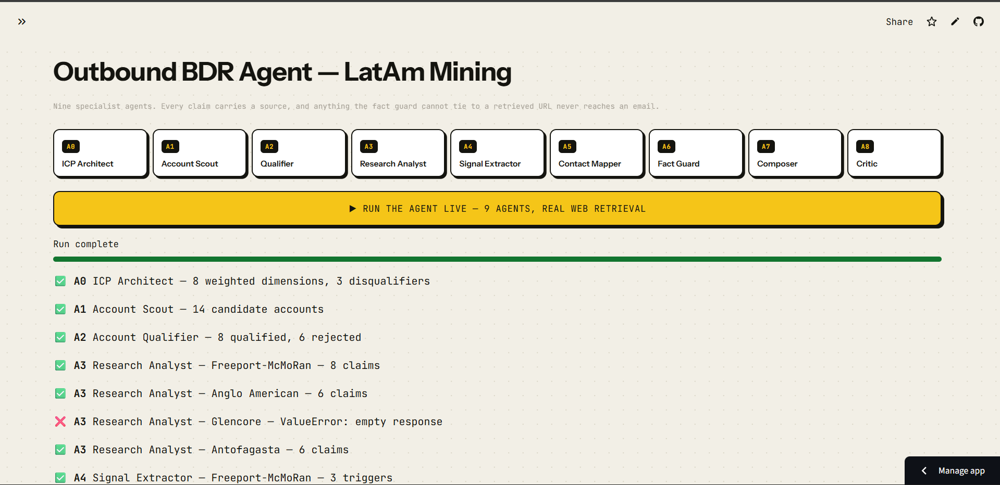
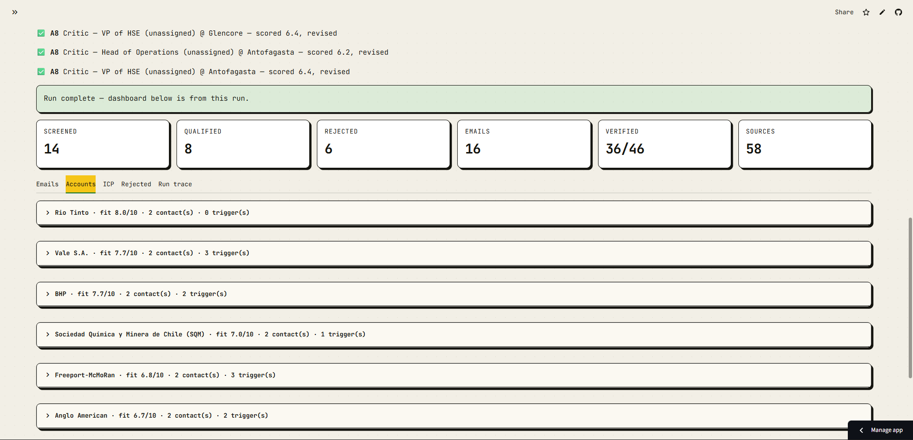
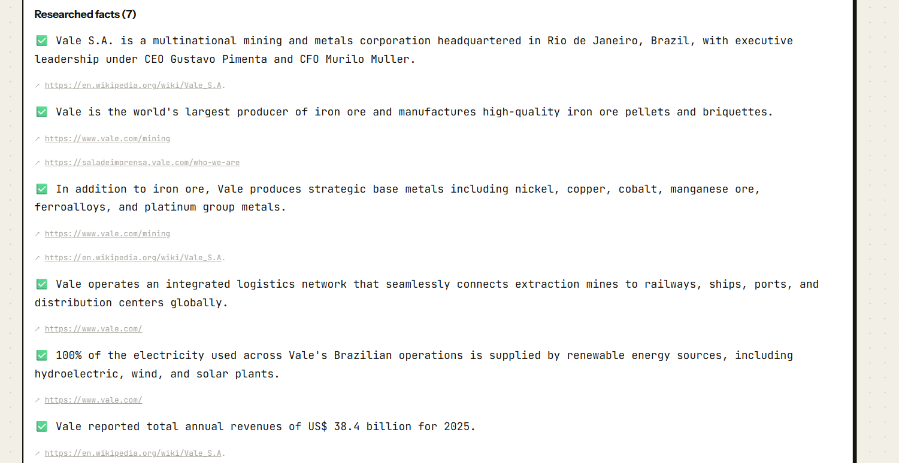

<div align="center">

# 🛡️ Outbound BDR Agent

### A 9-Agent AI Pipeline That Writes Sales Emails It Can Prove

*Every claim is source-verified. Every rejection is explained. Every failure is logged.*
*Fabricated data doesn't get filtered out — it's **architecturally unrepresentable**.*

**[Live Dashboard →](https://flytbase-outbound-bdr.vercel.app)** &nbsp;|&nbsp; **[Thinking Map →](docs/mindmap.html)** &nbsp;|&nbsp; **[Submission →](submission.md)**

</div>

---

## 📊 What One Run Produces

A single pipeline execution against **Latin American mining enterprises** — targeting autonomous drone inspections for hazardous 24/7 extraction sites — generates this:

| Metric | Result |
|--------|--------|
| **Accounts Screened** | 14 candidates discovered via live web retrieval |
| **Qualified** | 8 accounts passed ICP scoring (Rio Tinto, Vale, BHP, SQM, Freeport-McMoRan, Anglo American, Glencore, Antofagasta) |
| **Rejected** | 6 accounts — *with written rationale for every rejection* |
| **Emails Generated** | 16 personalized cold emails with call openers + objection handling |
| **Claims Verified** | 36 of 46 verified · 10 quarantined by fact guard · **0 fabricated data in any email** |
| **Sources Retrieved** | 58 unique web sources, each carried as a clickable citation |
| **Runtime** | ~6 minutes end-to-end (real web retrieval, not cached data) |

> **Sample output** — generated email to Head of Operations at BHP:
>
> *"BHP operates across multiple countries, including Australia and Canada. With $51.26 billion in revenue in 2025, optimizing costs is a priority. Contracted crews perform hazardous inspections at extraction sites, but autonomous drone inspection can replace these crews. Anglo American reduced inspection time by 70% and improved accuracy by 25% through autonomous inspection. We can discuss how autonomous inspection could work at BHP's copper sites in Chile."*
>
> **Proof point selected:** Anglo American — chosen as the closest operational analogue for a copper producer. The composer evaluates three reference customers and picks *one* that fits; it doesn't name-drop all three.

---

## 🎬 Demo

<div align="center">

[](https://www.youtube.com/watch?v=InrGfEJbvuM)

**[▶ Watch the Full Demo on YouTube](https://www.youtube.com/watch?v=InrGfEJbvuM)** — Live pipeline run from campaign brief to personalized emails

</div>

### Live Pipeline Execution

Press one button — watch 9 agents execute in real time with live progress, search queries, and source retrieval:

<div align="center">

</div>

<br/>

### Results Dashboard

Qualified accounts ranked by ICP fit score, with metrics strip showing 14 screened → 8 qualified → 16 emails → 36/46 verified:

<div align="center">

</div>

<br/>

### Source-Verified Research

Every claim carries a clickable citation. Unsourced claims are quarantined by the deterministic fact guard — they never reach an email:

<div align="center">

</div>

---

## 🧠 The Core Problem — And Why This Approach Is Different

The hard part of AI-driven outbound is **not** getting a model to write an email. It's making sure the email doesn't contain a single fabricated claim, a non-existent contact, or a dead URL — because one hallucinated fact destroys credibility on first contact.

### What Typically Goes Wrong

| Approach | Failure Mode |
|----------|-------------|
| **Single mega-prompt** | LLM conflates research, qualification, and writing into one opaque step. You can't trace *which* claim is wrong or *why* a prospect was chosen. |
| **"Cite your sources" in the prompt** | This is a *suggestion*, not a constraint. Models routinely fabricate plausible-looking URLs. |
| **LLM-based fact-checker** | A language model validating another language model's output can hallucinate approval of its own hallucinations. |

### How This System Solves It

**Three structural layers** make fabricated data architecturally impossible:

```
Layer 1: RETRIEVAL-FIRST CITATION
  Web Search → Evidence Block [0] [1] [2]... → LLM cites by INDEX → Python maps index → Source object
  ✦ The model never generates a URL. It says "source: [0, 2]" and Python resolves those
    to actual Hit objects from the search results. Fabricated URLs are unrepresentable.

Layer 2: DETERMINISTIC FACT GUARD (Agent 6)
  Pure Python — zero LLM calls. Validates every source URL is resolvable http(s),
  filters weak domains (social media), quarantines unsourced claims.
  ✦ Cannot be prompt-injected. Cannot hallucinate self-approval. It's regex and set logic.

Layer 3: GRACEFUL DEGRADATION
  When LinkedIn auth blocks executive scraping, the system refuses to invent names.
  Falls back to role-targeted outreach: "Head of Operations (unassigned)"
  ✦ Integrity over vanity metrics. Every gap is flagged, never silently filled.
```

---

## 🏗️ Architecture — Nine Specialist Agents

Instead of one monolithic prompt, the pipeline is decomposed into **nine agents with typed data contracts**. Each agent has exactly one job, one guarantee, and one failure mode — all visible in the run trace.

```
                        ┌─────────────────────┐
                        │   Campaign Brief    │
                        │  LatAm Mining × SQM │
                        └─────────┬───────────┘
                                  │
                        ┌─────────▼───────────┐
                        │   A0  ICP Architect  │ ──► 8 weighted dimensions + 3 disqualifiers
                        └─────────┬───────────┘
                                  │
                        ┌─────────▼───────────┐
                        │   A1  Account Scout  │ ──► 14 candidates via live Bing RSS
                        └─────────┬───────────┘
                                  │
                        ┌─────────▼───────────┐
                        │   A2  Qualifier      │ ──► 8 qualified  ·  6 rejected (with reasons)
                        └─────────┬───────────┘
                                  │
               ┌──────────────────┼──────────────────┐
               │                  │                  │
     ┌─────────▼──────┐ ┌────────▼────────┐ ┌───────▼──────────┐
     │ A3  Research    │ │ A4  Signal      │ │ A5  Contact      │
     │ Analyst         │ │ Extractor       │ │ Mapper           │
     │ Atomic claims   │ │ Dated triggers  │ │ Ops/HSE leaders  │
     │ with citations  │ │ mapped to angle │ │ or role fallback  │
     └────────┬────────┘ └────────┬────────┘ └───────┬──────────┘
               │                  │                  │
               └──────────────────┼──────────────────┘
                                  │
                    ┌─────────────▼──────────────┐
                    │  A6  Verifier / Fact Guard  │ ──► PYTHON ONLY. No LLM.
                    │  36/46 verified · 10 quarantined │    Unsourced = quarantined.
                    └─────────────┬──────────────┘
                                  │ (verified data only)
                    ┌─────────────▼──────────────┐
                    │  A7  Message Composer       │ ──► 16 emails, each with proof point
                    └─────────────┬──────────────┘
                                  │
                    ┌─────────────▼──────────────┐
                    │  A8  Critic Loop            │ ──► Hard checks + rubric scoring
                    │  Rewrites if score < 7.5    │    Catches buzzwords, placeholders,
                    └─────────────────────────────┘    generic openings
```

### Agent Breakdown

| Agent | Responsibility | What It Guarantees |
|-------|---------------|-------------------|
| **A0** ICP Architect | Deconstruct reference account (SQM) into a machine-readable scoring model | Every scoring axis traces to the anchor account — no arbitrary weighting |
| **A1** Account Scout | Discover real LatAm mining operators via live web retrieval | Over-fetches (target + 6 extra) so the qualifier has candidates to cut |
| **A2** Qualifier | Score every candidate on every ICP axis; apply disqualifiers | **Allowed to say no** — rejected accounts are kept with written rationale |
| **A3** Research Analyst | Deep per-account research producing atomic, cited claims | Each claim cites evidence by index, not prose blobs with made-up facts |
| **A4** Signal Extractor | Convert research claims into dated trigger events | Separates "they expanded a mine in Q1 2025" from "they're a mining company" |
| **A5** Contact Mapper | Find Head of Operations / VP of HSE / Site Directors | **Returns nothing** rather than inventing a person. Degrades to role-targeted outreach. |
| **A6** Verifier | Quarantine claims without resolvable source URLs | **Deterministic Python** — a guard that *cannot* hallucinate its own approval |
| **A7** Composer | Draft a personalized email per contact using verified material only | Selects *one* best-fit proof point (Anglo American / Shell / CSX) per account |
| **A8** Critic | Rubric-score drafts, rewrite once if below 7.5/10 | Hard checks for placeholders, buzzwords, word count violations, generic openers |

---

## ⚡ Tech Stack

| Layer | Choice | Reasoning |
|-------|--------|-----------|
| **Primary LLM** | Groq (`llama-3.3-70b-versatile`) | Lowest latency for high-volume drafting and reasoning |
| **Fallback LLM** | Google Gemini (`gemini-2.5-flash`) | Automatic failover when Groq hits daily quota caps |
| **Web Retrieval** | Bing RSS + Wikipedia API | **Keyless** — zero API keys needed for evidence gathering |
| **State Management** | Python `dataclass` contracts | Typed handoffs between agents; `Source` is required on every fact |
| **Interactive UI** | Streamlit | Live pipeline execution with real-time agent progress |
| **Static Dashboard** | Vanilla HTML/CSS/JS | Zero-build, deployed on Vercel / GitHub Pages |
| **Dependencies** | `requests` + `streamlit` | Intentionally minimal — **no LangChain, no LlamaIndex, no framework lock-in** |

### Resilience Engineering

- **Circuit Breaker**: When Groq hits its daily token cap (HTTP 429), `_generate()` trips `_EXHAUSTED` and routes *all* subsequent calls to Gemini — no wasted backoff retries
- **Overwrite Guard**: If a run produces 0 accounts (quota failure), the system refuses to overwrite a previous successful `results.json`. Failed output goes to `results.failed.json`
- **Pre-flight Validation**: `run.py --check` issues *real API requests* to each provider — because models can be listed by the API but rejected at call time

---

## 🚀 Get It Running

Two free API keys, no credit card required:

| Provider | Get Key | Used For |
|----------|---------|----------|
| **Gemini** | [aistudio.google.com/apikey](https://aistudio.google.com/apikey) | Grounded research + fallback generation |
| **Groq** | [console.groq.com/keys](https://console.groq.com/keys) | Email drafting + critic loop |

```bash
# Setup
python -m venv .venv
.venv/Scripts/activate            # Windows  (source .venv/bin/activate on macOS/Linux)
pip install -r requirements.txt

# Configure
cp .env.example .env              # paste your two keys into .env

# Validate (catches bad model IDs in 2 seconds instead of mid-run)
python run.py --check

# Run the full pipeline
python run.py                     # writes results to data/results.json

# View the dashboard
python -m http.server 8080 -d docs
```

Or run the **interactive Streamlit dashboard** to watch all 9 agents execute in real time:
```bash
streamlit run app.py
```

---

## 📁 Project Structure

```
├── run.py                         # CLI entry point (--check validates APIs, then runs pipeline)
├── app.py                         # Streamlit interactive dashboard with live agent execution
├── requirements.txt               # Just requests + streamlit. That's it.
├── .env.example                   # API keys + tunable parameters
│
├── src/
│   ├── config.py                  # Campaign brief, proof points, company context
│   ├── schemas.py                 # Typed state contracts (Source required on every Claim)
│   ├── search.py                  # Keyless web retrieval (Bing RSS + Wikipedia + page fetcher)
│   ├── llm.py                     # Provider abstraction + index→URL citation engine
│   ├── trace.py                   # Per-stage execution telemetry + quarantine logging
│   ├── orchestrator.py            # DAG runner + result assembly + overwrite guard
│   └── agents/
│       ├── a0_icp_architect.py    # Reference account → weighted ICP dimensions
│       ├── a1_account_scout.py    # Candidate discovery with over-fetch strategy
│       ├── a2_account_qualifier.py # Multi-axis scoring + rejection tracking
│       ├── a3_research_analyst.py # Deep research → atomic claims with citations
│       ├── a4_signal_extractor.py # Research → dated trigger events
│       ├── a5_contact_mapper.py   # Executive discovery (refuses to fabricate)
│       ├── a6_verifier.py         # DETERMINISTIC Python fact guard — no LLM
│       ├── a7_composer.py         # Personalized emails + call openers + objections
│       └── a8_critic.py           # Hard checks + rubric scoring + revision loop
│
├── data/
│   └── results.json               # Full pipeline output artifact
│
└── docs/                          # Static dashboard (Vercel / GitHub Pages)
    ├── index.html
    ├── app.js
    ├── styles.css
    ├── mindmap.html               # Interactive architectural thinking map
    └── data/results.json
```

---

## 📈 Output Artifact

Every run produces a single `results.json` containing the complete pipeline output:

- ✅ Derived ICP with weighted dimensions and disqualifiers
- ✅ Qualified accounts, ranked, with per-axis scoring and written rationale
- ✅ Rejected accounts with explicit rejection reasons
- ✅ Cited research claims with quarantine status
- ✅ Dated trigger events mapped to the sales angle
- ✅ Contacts with verification status (`found` / `inferred` / `not_found`)
- ✅ Personalized email per contact + cold-call opener + objection handling
- ✅ Full run trace: every stage, duration, searches issued, sources returned, failures, and written fixes

The static dashboard in `docs/` renders this file directly. No build step. No framework.

---

## 🔍 Known Limitations & Engineering Trade-offs

These are documented intentionally — the system handles each one explicitly rather than hiding it.

| Limitation | Why It Exists | How The System Handles It | Production Fix |
|-----------|--------------|--------------------------|---------------|
| **Contact discovery gaps** | Public leadership pages are JS-rendered; LinkedIn is behind auth | Returns `"Head of Operations (unassigned)"` — never invents a name | Plug Apollo / Cognism / Sales Navigator behind A5 with the same verification gate |
| **English-language search bias** | Bing RSS skews to English; LatAm operational news is in Spanish/Portuguese | Acknowledged in trace; claims may under-represent local press | Run A3 twice per account with localized query sets, merge on claim similarity |
| **Free-tier rate limits** | Groq caps at 100k tokens/day; Gemini rate-limits during fan-out | Circuit breaker fails over instantly; overwrite guard protects prior results | Use paid tiers or self-hosted models. Account count is a config value, not a design limit |
| **~6 minute runtime** | 9 sequential agents × real web retrieval per stage | Each stage streams progress to Streamlit UI | Add async fan-out for A3/A4/A5 per account |

---

<div align="center">

**Built for the FlytBase Outbound BDR challenge** · Zero fabricated data · Full auditability · Every failure explained

</div>
