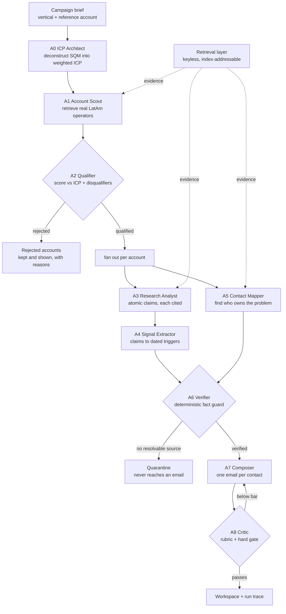

# submission

## What I built

A nine-agent outbound pipeline that takes the campaign brief — LatAm mining, anchored
on SQM — and produces a ranked account list, contacts, cited research, and a
personalised email per contact, with a run trace showing exactly where it succeeded
and where it hit a wall.

The design question I cared about was not "can a model write an email." It was **how
do you decompose the job so every claim is checkable and every failure is
attributable**. That decision drove everything else.

## Architecture / Flow

**Data flow.** One `RunState` object threads through every agent. No agent calls
another; the orchestrator wires them, so the whole flow is readable in one file.

**The decision points that matter:**

| Where | Decision | Both branches |
|---|---|---|
| A2 | Does this clear the ICP? | Rejects are shipped with reasons, not dropped |
| A5 | Can I verify a real person? | If no, role-targeted outreach — never an invented name |
| A6 | Does this claim resolve to a source? | If no, quarantined and made unusable by A7 |
| A8 | Does the draft clear the rubric? | If no, one rewrite with specific instructions |

## Why this solves the brief

**Provenance is structural, not a prompt instruction.** I originally used Gemini's
Google Search grounding for citations. It returned `429 — check your plan and billing`
on the free tier, so I rebuilt it retrieval-first: `src/search.py` retrieves a real
result set, the model receives a **numbered** evidence list and cites *by index*, and
`sources_from_indexes` maps those indexes back to URLs actually fetched. The model
never emits a URL, so a fabricated citation is **unrepresentable** rather than merely
discouraged. That is a stronger guarantee than grounding was.

**The fact guard is deliberately not an LLM.** Every other stage is a model call. A6
is regex and set logic over URLs. A verifier that is itself a language model can be
talked into approving its own hallucination; one that checks whether a string is a
resolvable non-social URL cannot.

**Nine agents, not one prompt.** The brief names the failure mode explicitly —
delegating across sub-agents versus dumping everything on one. Each agent here has one
job and a typed contract with the next.

## Evidence from the codebase

| File | What it proves |
|---|---|
| `src/agents/a0..a8` | Nine separate modules, one job each, typed handoffs |
| `src/schemas.py` | `Source` is a **required field** on every `Claim`, `Trigger`, `Contact` |
| `src/search.py` | Keyless retrieval; citations originate here, not from the model |
| `src/llm.py` → `sources_from_indexes` | Index-to-URL mapping — the anti-fabrication mechanism |
| `src/agents/a6_verifier.py` | The fact guard, in plain Python |
| `src/agents/a8_critic.py` | Deterministic disqualifier gate + scored reflection loop |
| `src/trace.py` | Per-stage record with a written fix for each failure |
| `app.py` | Live runner — press one button, watch nine agents execute |

## Demo / results

<!-- RESULTS_PLACEHOLDER -->

## Notes and limitations

**Contact discovery is the weakest stage, and I did not paper over it.** Keyless web
search cannot reliably surface named operations and HSE leaders: corporate leadership
pages are JavaScript-rendered, and the richest source (LinkedIn) is behind auth. The
model correctly refused to name anyone rather than guess — the trace records it saying
*"the provided evidence does not mention the company or any of its employees."*

Rather than invent a persona, the pipeline degrades to **role-targeted outreach**: a
real role at a real company, explicitly flagged as unassigned in the UI. Production
fix is to put a licensed provider (Apollo / Cognism / Sales Navigator) behind that same
stage — the verification gate downstream is unchanged, so nothing enters an email
unsourced.

**Free-tier ceilings shaped the run, not the architecture.** Groq's 100k tokens/day cap
was hit mid-run; `_generate` now trips a circuit breaker on a daily cap and fails over
to Gemini instead of burning three back-off sleeps per call. Account count is a config
value, not a design limit.

**English-language search bias** under-reports Spanish and Portuguese local press —
exactly where mine-level operational news lives. Fix is to run A3 twice per account
with localised query sets and merge on claim similarity.

**Two things that bit me, both worth knowing:** Bing's RSS view silently ignores the
query without an explicit `mkt=en-US` (it returned Chinese minesweeper pages for a
Codelco query), and `gemini-2.5-flash` is *listed* by the models endpoint but rejected
at call time as "no longer available to new users." `run.py --check` now issues real
requests rather than trusting a listing.
